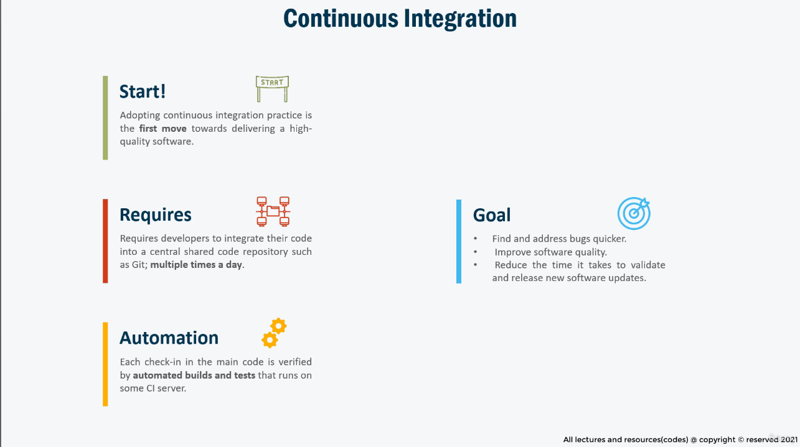
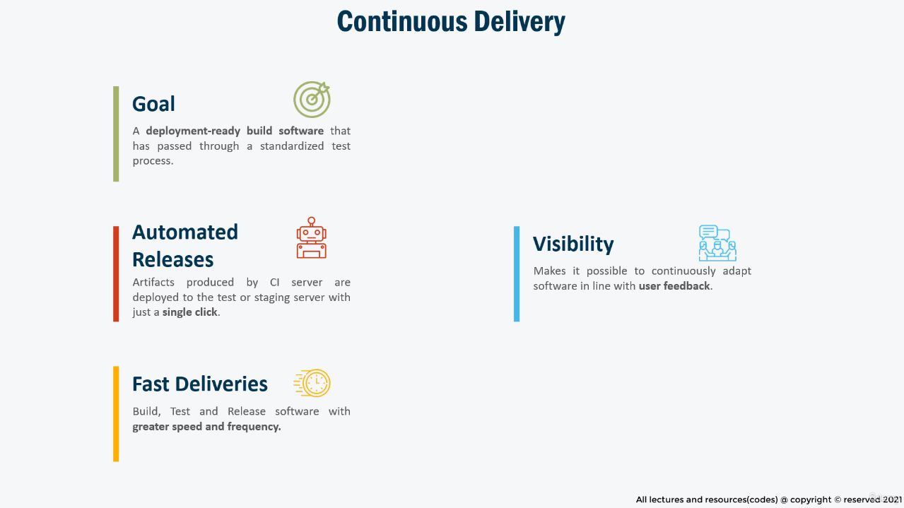
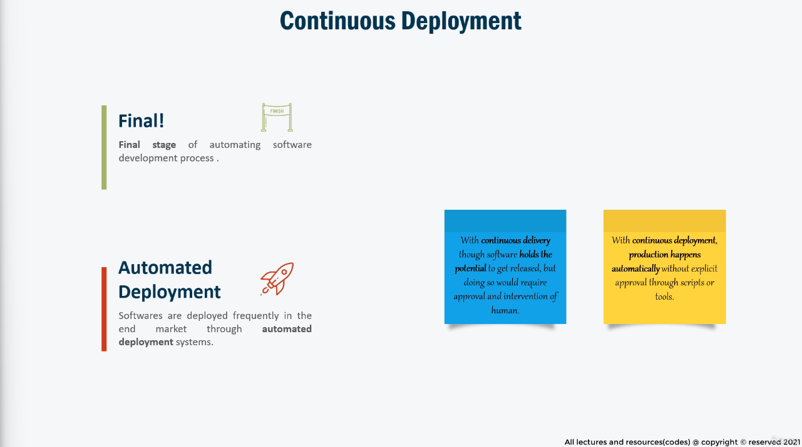

### Detailed Summary of CI/CD Concepts

**Introduction to CI/CD**
- CI/CD stands for **Continuous Integration (CI)** and **Continuous Delivery/Continuous Deployment (CD)**, which are methodologies designed to enhance software development by introducing automation.
- The primary goal of CI/CD is to enable frequent and reliable delivery of software applications by automating various stages of the development lifecycle—such as integration, testing, building, and deployment.
- CI/CD is not a tool or technology but a **set of operating principles and practices** that optimize the development and deployment processes, minimizing human intervention and the risk of errors.

**Continuous Integration (CI)**
- CI is a development practice where developers frequently integrate their code into a shared repository, typically multiple times a day. This ensures smaller, manageable updates instead of large, complex integrations over long periods.
- Automated builds and tests verify every new code integration. Errors are immediately surfaced, allowing teams to address issues early, improving software quality and reducing debugging time.
- The main goals of CI are:
  1. **Quick Bug Detection**: Immediate feedback upon code integration ensures bugs are addressed quickly.
  2. **Software Quality Improvement**: Regular automated testing ensures consistency and quality.
  3. **Faster Validation**: Smaller, frequent integrations make it quicker to validate and deploy updates.

**Example**:
- A team using Git for version control integrates updates into a central branch. Each commit triggers an automated pipeline that runs unit tests. If a test fails, the responsible developer is notified immediately to fix the issue before it escalates.

**Continuous Delivery**
- Continuous Delivery builds on CI by automating the delivery of application artifacts to testing or staging environments, creating a **deployment-ready build** that has passed standardized tests.
- The focus is on **speed and frequency**, ensuring that software can be deployed at any time with minimal additional effort.
- It addresses the issue of poor communication between development and business teams by fostering faster adaptation to user feedback.

**Key Features of Continuous Delivery**:
1. **Automated Release Process**: Streamlined processes eliminate the need for manual intervention.
2. **Deployment-Ready Builds**: Artifacts are always ready for production deployment.
3. **Improved Collaboration**: Ensures alignment between development goals and business needs.

**Example**:
- After CI testing, an automated pipeline deploys a tested build to a staging environment where it is reviewed by stakeholders. The system is ready for production deployment, awaiting a green light.

**Continuous Deployment**
- Continuous Deployment takes automation to the next level by automating the release of updates to production without manual approval.
- The key distinction between **Continuous Delivery** and **Continuous Deployment** is the removal of manual intervention. In Continuous Deployment, software changes are automatically built, tested, and deployed to production.

**Benefits of Continuous Deployment**:
1. **Zero Manual Approvals**: Updates are automatically pushed live, streamlining the process.
2. **Business Value Realization**: End-users gain access to new features and fixes quickly.
3. **Developer Empowerment**: Developers can push a code change live with a single commit.

**Example**:
- A developer commits a code change to the repository. The pipeline automatically tests the code, builds it, and deploys it to production. Within minutes, the updated application is live for end-users.

**CI/CD Pipeline in Action**
- The CI/CD pipeline is a series of automated steps executed in a defined order:
  1. **Code Integration**: Developers commit code changes to a version control system (e.g., Git).
  2. **Automated Testing**: The pipeline triggers unit tests to ensure the changes work as expected.
  3. **Build Process**: Artifacts are created from the codebase.
  4. **Delivery to Staging**: Artifacts are deployed to test or staging environments.
  5. **Production Deployment**: In Continuous Deployment, this step is automatic.

**Practical Demonstration**:
- In this course, the instructor promises to show how a minor code change can be committed, tested, built, delivered, and deployed within minutes—demonstrating the real power of CI/CD.

**Key Takeaways**:
- CI/CD transforms software development, reducing time-to-market, improving quality, and enabling rapid adaptation to user needs.
- Understanding the differences between **Continuous Integration**, **Continuous Delivery**, and **Continuous Deployment** is crucial for effective implementation.
- Automation is central to CI/CD, leveraging tools and scripts to minimize manual effort and enhance efficiency.

This foundational knowledge prepares teams to adopt CI/CD practices and leverage its benefits to streamline their software development lifecycle.