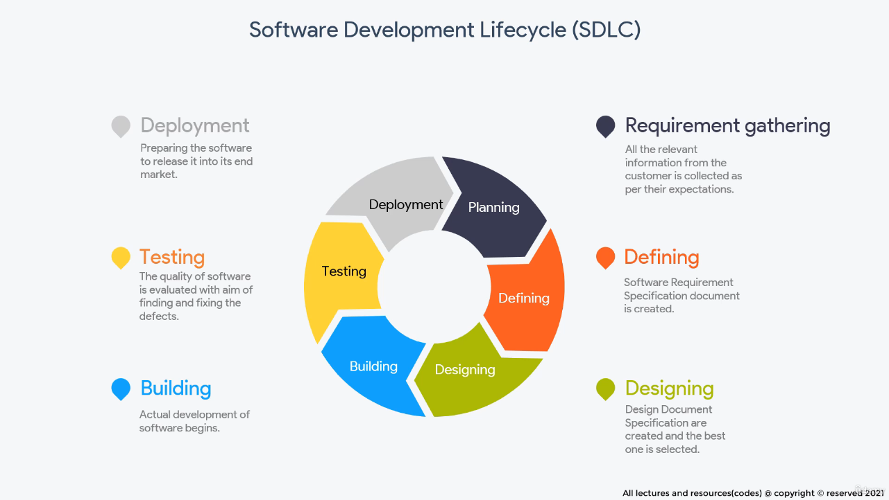

### Summary of Software Development Lifecycles (SDLC) and the Need for CI/CD

---

#### **Overview of SDLC**
The **Software Development Lifecycle (SDLC)** is a systematic approach used to develop high-quality software that meets customer expectations while staying within time and budget constraints. It comprises several key phases, each with distinct roles and objectives:

1. **Planning and Requirement Analysis**:
   - Gathering relevant information from customers about their expectations.
   - Performed by senior team members, with inputs from stakeholders.
   - Includes risk analysis and quality assurance planning.

2. **Defining Requirements**:
   - Formal documentation of requirements into a **Software Requirements Specification (SRS)**.
   - SRS serves as the reference for all subsequent stages of development.

3. **Designing the Architecture**:
   - Design approaches are documented in a **Design Document Specification (DDS)**.
   - Designs are reviewed for robustness, cost, and feasibility, with the most suitable approach selected.

4. **Development (Building)**:
   - Actual coding begins based on the design blueprint.
   - Engineers follow predefined coding standards and the agreed-upon design.

5. **Testing**:
   - The developed code is tested against requirements to ensure it meets the defined quality standards.
   - Bugs and errors are identified and sent back to the development team for correction.

6. **Deployment**:
   - The software is deployed to production, making it available to users.
   - Includes subsequent maintenance to address errors or enhance functionality.

---

#### **Conventional SDLC Methodology**
Under traditional approaches, these phases are executed sequentially, with significant manual intervention at every stage. A hypothetical **food ordering mobile application** development project helps illustrate this:

- **Multiple Teams**:
  - Teams such as front-end, back-end, and database development work independently.
  - Code is maintained in isolated branches using tools like Git, or in worst cases, kept locally.

- **Manual Integration**:
  - After weeks or months, code from all branches is sent to a **Build and Integration team**.
  - Developers assist this team in merging and compiling the code.
  - The integrated code is compiled into a deployable software package.

- **Manual Handover**:
  - The build package, along with deployment instructions, is manually handed to the operations team.
  - Operations prepare environments based on instructions, often prone to miscommunication or errors.

- **Iterative Testing**:
  - The QA team tests the software in a staging environment, identifies bugs, and sends them back to developers for fixes.
  - Re-testing involves repeating many steps, making it time-consuming.

- **Deployment and Maintenance**:
  - Once approved, the software is deployed to production, and the process is repeated for subsequent updates.

Each iteration takes weeks or months, causing delays and inefficiencies.

---

#### **Drawbacks of Conventional SDLC**
1. **Integration Challenges**:
   - Developers often delay integrating their code into a central repository, leading to **code conflicts** and a **messy integration process**.
   - Manual integration by the Build and Integration team takes significant time and resources.
   - Integration defects surface late, making them harder to diagnose and fix.

   **Example**: Developers working on different parts of a food app (e.g., payment gateway, menu system) delay merging their changes. After weeks, conflicting changes lead to significant rework and integration bottlenecks.

2. **Operational Errors**:
   - Deployment instructions are manually interpreted by operations teams, leading to potential **miscommunication** or **misconfiguration**.
   - Preparing environments manually increases the risk of errors and delays.

   **Example**: Missing a dependency installation in the instructions could cause deployment failures, delaying production releases.

3. **Long Feedback Cycles**:
   - Testing phases are lengthy, and bugs are communicated to developers late in the process.
   - Rework involves repeating many manual steps, further delaying feedback.

   **Example**: A functional defect in the payment gateway is identified during QA testing. Fixing and re-testing involves rebuilding and re-deploying the app, taking days or weeks.

4. **Lack of Automation**:
   - Movement between SDLC phases is manual and unstandardized.
   - No templates or pipelines are in place to streamline transitions.
   - This results in inconsistent practices and delays.

   **Example**: Without predefined templates, the operations team might receive incomplete or unclear deployment instructions, causing delays.

5. **Inefficiency in Releases**:
   - Each iteration is time-intensive, making it impossible to keep up with fast-paced market demands.
   - Delayed releases impact user satisfaction and competitiveness.

---

#### **Transition to CI/CD**
The inefficiencies in conventional SDLC practices paved the way for CI/CD adoption. **Continuous Integration, Delivery, and Deployment** address these issues by introducing automation, improving collaboration, and enabling faster, more reliable software delivery. 

Key benefits CI/CD offers over conventional SDLC:
1. **Automated Integration and Testing**:
   - Frequent code commits are automatically tested and merged, avoiding integration bottlenecks.
   - Developers receive instant feedback on defects.

   **Example**: A developer commits a change to the food app. Automated tests catch a bug in the payment gateway immediately, allowing it to be fixed before integration.

2. **Standardized Pipelines**:
   - Well-defined pipelines automate transitions between phases, reducing manual intervention.
   - Build, test, and deploy steps are executed automatically using tools like Jenkins or GitLab CI.

3. **Reduced Feedback Loops**:
   - Developers are notified of bugs minutes after a commit, enabling quicker fixes.
   - Testing and QA are integrated into the pipeline, shortening the cycle time.

4. **Error-Free Deployments**:
   - Automated deployment scripts ensure consistent and error-free production releases.
   - Manual intervention is eliminated, reducing the risk of miscommunication.

5. **Rapid Iterations**:
   - CI/CD enables teams to release updates multiple times a day, compared to weeks or months in traditional SDLC.

---

### **Conclusion**
The limitations of traditional SDLC—manual integration, operational inefficiencies, long feedback cycles, and lack of automation—highlight the need for CI/CD methodologies. CI/CD eliminates these drawbacks, enabling teams to deliver high-quality software faster and more reliably, which is essential in today's fast-paced digital landscape. Future lectures will dive into how CI/CD achieves these improvements in practice.